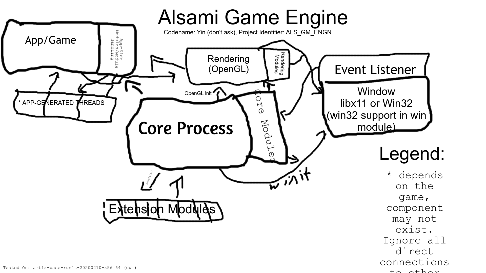

# Game Engine

This is a game engine I am working on as a simple project. This game engine contains a few componetents that we will get into after this section about what makes this game engine different than most game engines

NOTE BEFORE READING:
  This engine is likely to go through a ton of rewrites. I'm learning with every line of C++ and C I write. This engine will probably not be stable for a few months.

Premable:
  Game Engines are not supposed to be one-size-fits-all engines. While this can be done efficiently with a lot of effort, I don't see the point in trying to use one engine for a ton of use cases.
  Game Engines are supposed to assist with game rendering, but not abstract the APIs away. You should still be to use OpenGL functions.
  Game Engines are also supposed to be open source. Why would you make a game on a engine which has source code that you dont even know or cant even modify to your needs?
  
  ALSGM intends to fix all that.
  
## Dependencies
*AlsGM (Codename Yin) Relies on mulitple dependencies for redenring and API implementation*
* Vulkan Must be linked (if vulkan selected in config.h file)
* OpenGL Must be linked (if opengl selecting in config.h file)
* GLFW (if vulkan) 
* Xlib Header Files (This makes alsgm practically gnu/(linux or hurd) exclusive)
* Pthread and `sys/` files (This makes alsgm POSIX-Exclusive)

**What is it?**
	ALSGM is a module-based game engine, Moduels can be both written in C or C++. Unlike most game engines, it's actually compiled with the game itself. This helps because the game studio can easily make new modules and extend the engine's functionality.  

**What Does it do?**

**How Does it work?**
	ALSGM has 2 types of modules, core modules and expandability modules. Core modules are things like the Event System, the Logging System, and the Interface with OpenGL. These are all considered extremly critical for the stable operation of aslgm. These are all loaded before the Application's entry point is spun off onto a new process. Also, ALSGM has a differnt kind of module called expandability modules. These modules, while also loaded before the app spins off into it's own process, are considred much less critical, have a less privliges than the core modules, but also can have more integration with things that are not strictly part of the app/engine

I also don't think this should be the only game engine you should ever use. If you know C++ or C, try experimenting with making your own game engine!
Learning Resources:
  https://www.youtube.com/watch?v=dZr-53LAlOw&list=PLlrATfBNZ98dC-V-N3m0Go4deliWHPFwT&index=6
  *The Cherno's Videos did help me with this project, but if you want to develop a game engine for Linux like me, you will need other resources and a good knowledge of OpenGL or Vulkan and Xlib. If you really want, I will put some of the key components of this rendering engine in a seperate GitHub Repository

Note Before Contributing:
Please read the CONTRIBUTING file before pull-reqesting alsgm. While it is not required, it is __highly__ reccomended to do so as it will give you a ton of good advice

Official Public Mirror (GitHub):
  https://github.com/alsamitech/alsgm

__if you want a good alternative of alsgm for Windows, see https://github.com/thecherno/Hazel__

>>> NOTE: Don't ask why there are so many  mentions of the word "Yin", it's a long story that I don't feel like explaining.
